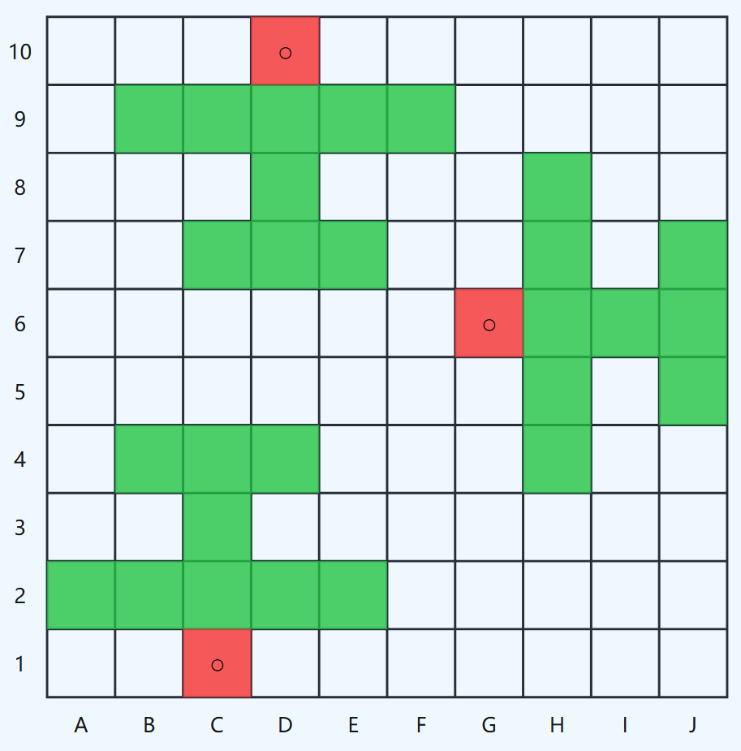
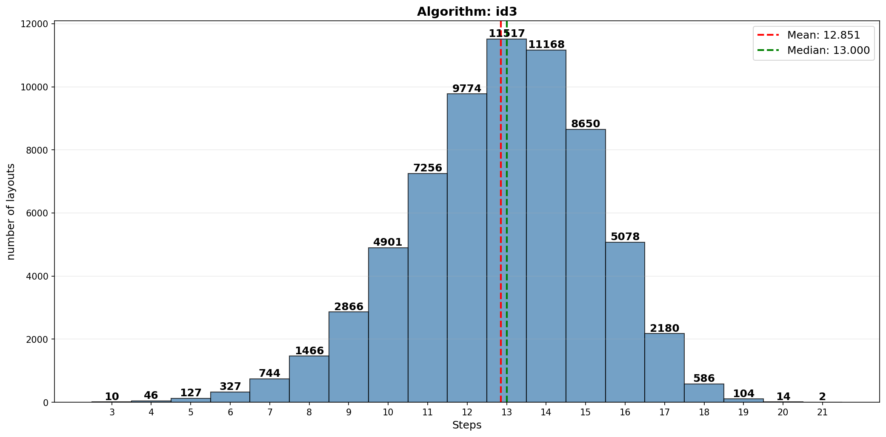

# 炸飞机/飞机大战 游戏AI

[](https://github.com/mathmonkeyliu/zfj)
[](https://github.com/mathmonkeyliu/zfj/stargazers)
[](https://github.com/mathmonkeyliu/zfj/network/members)
[](https://github.com/mathmonkeyliu/zfj/issues)
[](https://github.com/mathmonkeyliu/zfj/commits/main)
[](https://github.com/mathmonkeyliu/zfj)

本项目是**炸飞机**（又称**飞机大战**）游戏的AI。

## 游戏规则

可以参考[https://mp.weixin.qq.com/s/ni7TqwWlA7PldDzgUsAL8w](https://mp.weixin.qq.com/s/ni7TqwWlA7PldDzgUsAL8w)

简单来说，游戏棋盘是一个 10x10 的方格表，其上放置着 3 架飞机，每一架飞机的形状都一样，为“士”字行。每个飞机占据10个格子，有1个格子是机头（红色），9个格子是机身。飞机可以朝上、下、左、右四个方向放置，但是不能重叠。比如下面是一个符合规则的布局：



游戏分为两个阶段，**布局阶段**和**攻击阶段**
- **布局阶段**：将自己的三架飞机按符合要求的方式布局。
- **攻击阶段**：双方布局完成后进入攻击阶段，攻击阶段双方点击对方的棋盘中的格子，并可以得到这个格子所属飞机的部分的反馈，包括不属于飞机、属于飞机的机身、属于飞机的机头。

**获胜条件**：先击中对方三个机头的人获得胜利。

游戏没有先后手之分，同一回合先下手为强。

## 在线使用

开发中...

## 游玩

可以在[https://game.hullqin.cn/zfj](https://game.hullqin.cn/zfj)游玩。

## 依赖

项目依赖位于 `requirements.txt` 文件中。

如果使用 `uv`，则直接运行以下命令即可：
```bash
uv sync
```

## 算法介绍与使用方法

> 在这个游戏中，我们假设布局的先验概率是均匀分布。

首先，你要先运行```python layout_generater.py```生成所有可能的布局。

### ID3

经典的决策树信息熵增益的算法。可以枚举出有66816种布局方式和33344种机头的排列。每一步，我们遍历所有没有点击的格子（也就是未知状态的格子），计算点击他们之后的信息增益。然后选择信息增益最大的那个格子（这里注意，如果信息增益相同，选择这个格子正好击中机头概率最大的格子）。

算法实现在```id3.py```里。

可以使用```evaluate.py```遍历所有布局，计算步数进行评估。

```python
python evaluate.py --method id3 --out evaluation_id3.png
```

评估结果如下：



在所有布局情况下，id3算法的平均数步数为**12.851**，中位数步数为**13.000**。

### min_avg

由于id3选出的动作未必是最优的，所以我们每一步选取id3信息增益最高的topk个格子（旋转对称的格子会被排除在外），搜索使得全局平均步数最低的那个策略。

> 当然，当topk=1时，就退化为id3算法。

算法实现在```min_avg.py```里。

可以通过以下命令计算并保存策略：
```python
python min_avg.py --out topk_1.json --topk 1
```

评估可使用
```python
python evaluate.py --method min_avg --checkpoint topk_1.json --out evaluation_min_avg_topk_1.png
```

这样的搜索计算量是十分大的，复杂度大概为$O((3\times\text{topk})^{depth})$，其中$depth$为搜索树的深度，也就是所花的步数。

于是，我实现了一个CPU并行计算的脚本```min_avg_cpu.py```，会自动读取你的CPU核心数并进行并行计算。

```python
python min_avg_cpu.py --out topk_2.json --topk 2
```

以上topk=2的命令在一个30核心的i9-9960X CPU上大概需要两天。

> topk=2的平均数（似乎）达到了**12.693**。

### min_step

这个是我之前做过的尝试，感兴趣的可以翻一翻之前的commit。方法同样是使用id3选出topk个动作，但这一次是只搜索最坏情况下的最大步数，因此可以使用alpha-beta剪枝，在topk=3的配置下计算到的最坏步数是19步。这意味着无论是什么样的游戏策略，在最坏的情况下，都至少需要19步。

> 19，又让你想起了什么呢？你想起的是一个年份，一个年纪，一个班级，还是一个学号呢？算了，我不想再猜了，就像她不想去猜你的内心一样。

## 后记

欢迎读者设计其它方法超越我的性能。可以通过[mathmonkeyliu@outlook.com](mailto:mathmonkeyliu@outlook.com)联系我。

## 作者

**刘泽睿**，来自中国科学技术大学(USTC)

