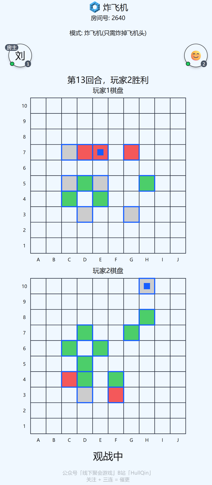

# 炸飞机 AI (Bombing Planes AI)

一个基于搜索算法的"炸飞机"游戏 AI，使用最小熵原理进行最优决策。

## 游玩

可以在[https://game.hullqin.cn/zfj](https://game.hullqin.cn/zfj)游玩。

## 游戏规则

### 游戏目标
两名玩家在 10×10 的网格上，率先找出并击落对方全部三架飞机者获胜。

### 核心规则

#### 1. 飞机布局
- 每方有 **3 架相同的飞机**
- 飞机形状为"士"字形，共占据 **10 个格子**（包括 1 个机头、9 个机身）
- 飞机形状说明：如果机头坐标为 (0, 0)，则其他 9 个格子（机身）的相对坐标为：
  - 第一行：(-2, -1), (-1, -1), (0, -1), (1, -1), (2, -1)
  - 第二行：(0, -2)
  - 第三行：(-1, -3), (0, -3), (1, -3)
- 飞机可以朝向上、下、左、右四个方向放置
- 飞机不能重叠，且不能超出 10×10 的方格表

#### 2. 游戏流程
- 玩家轮流点击 10×10 方格表中的一个格子）攻击对方
- 防守方根据被点击的方格告知结果：
  - **未击中**：未击中机身或者机头
  - **击中**：该格子是飞机的机身
  - **击落**：该格子是飞机的机头

## 项目结构

```
zfj/
├── config.py                    # 游戏配置（网格大小、飞机形状等）
├── layout_generater.py          # 生成所有可能的飞机布局
├── main.py
├── all_layouts.jsonl           # 所有合法布局数据
└── decision_tree/
    ├── __init__.py
    ├── solver.py               # AI 核心算法（最小熵搜索）
    ├── interactive_play.py    # 交互式游戏界面
    └── statistics.py          # 性能统计与分析
```

## 安装

### 依赖安装

使用 `uv`（推荐）：
```bash
uv sync
```

主要依赖：
- `numpy`
- `matplotlib`

## 使用方法

### 1. 生成所有合法布局（首次运行需要）

```bash
python layout_generater.py
```

这将生成 `all_layouts.jsonl` 文件，包含所有可能的 3 架飞机布局组合。

### 2. 交互式游戏

与 AI 进行交互式游戏，AI 会给出建议的打击坐标，您需要输入打击结果：

```bash
python -m decision_tree.interactive_play
```

游戏界面说明：
- `·` (灰色) = 未击中
- `X` (绿色) = 击中机身/机翼
- `H` (红色) = 击中机头（击落）
- `?` (黄色) = AI 建议的下一步打击位置

输入结果：
- `0` = 未击中 (Miss)
- `1` = 击中机身 (Body)
- `2` = 击中机头 (Head - 击落!)

### 3. 性能统计

运行统计测试，评估 AI 在不同布局下的表现：

```bash
python -m decision_tree.statistics
```

这将：
- 随机采样布局进行游戏模拟
- 统计平均步数、中位数、标准差等指标
- 生成可视化图表（直方图、CDF、箱线图等）
- 保存结果到 `statistics_results.png`

## AI 算法说明

本项目实现了一个基于**最小熵原理**的搜索 AI：

1. **状态空间维护**：维护所有符合当前已知信息的可能布局集合
2. **信息熵计算**：对每个可能的打击位置，计算其能提供的信息熵
3. **最优决策**：选择信息熵最大（信息增益最大）的位置进行打击
4. **击落奖励**：在熵值计算中加入击落机头的额外权重，优先考虑可能击落的位置

核心思想是在每一步都最大化信息获取，从而尽快缩小可能布局的空间，快速找到所有飞机。

## 未来计划

- 集成更多 AI 方法（如蒙特卡洛树搜索、深度强化学习等）
- 优化算法性能
- 添加更多统计和分析功能
- 支持人机对战和 AI 对战模式

## 致谢
致敬我的同学[鲁铭泽](https://github.com/maverickxone)，守护了人类最后的荣光！



## 作者

Designed by Ze Rui Liu, USTC
