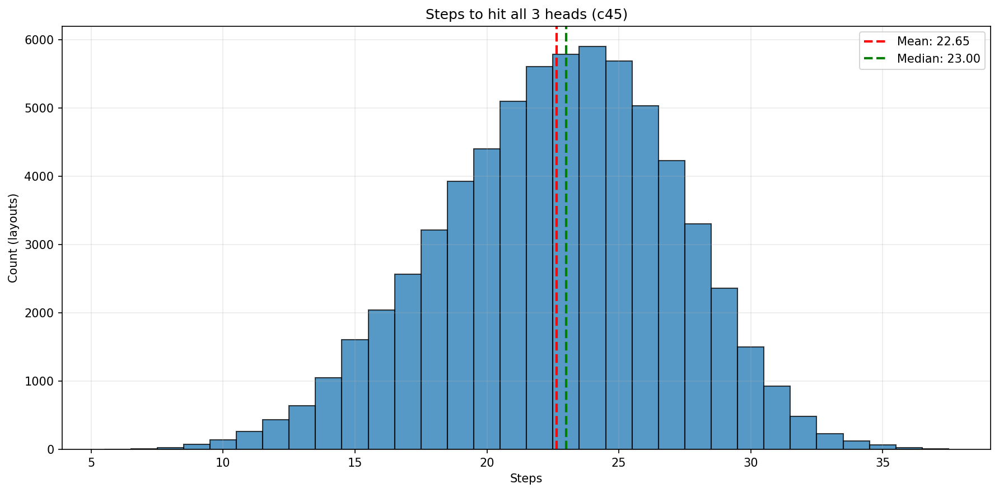

[](https://github.com/mathmonkeyliu/zfj)
[](https://github.com/mathmonkeyliu/zfj/stargazers)
[](https://github.com/mathmonkeyliu/zfj/network/members)
[](https://github.com/mathmonkeyliu/zfj/issues)
[](https://github.com/mathmonkeyliu/zfj/commits/main)
[](https://github.com/mathmonkeyliu/zfj)

# 炸飞机/飞机大战 游戏AI

**炸飞机**（又称**飞机大战**）游戏的AI。

## 游玩

可以在[https://game.hullqin.cn/zfj](https://game.hullqin.cn/zfj)游玩。

## 游戏规则

可以参考[https://mp.weixin.qq.com/s/ni7TqwWlA7PldDzgUsAL8w](https://mp.weixin.qq.com/s/ni7TqwWlA7PldDzgUsAL8w)

### 游戏目标
两名玩家在 10×10 的网格上，率先找出并击落对方全部三架飞机者获胜。

### 核心规则

#### 1. 飞机布局
- 每方有 **3 架相同的飞机**
- 飞机形状为"士"字形，共占据 **10 个格子**（包括 1 个机头、9 个机身）
- 坐标约定：使用矩阵坐标 (x, y)，其中 **x 表示行(row)**、**y 表示列(col)**
- 飞机形状说明：如果机头坐标为 (0, 0)，则其他 9 个格子（机身）的相对坐标 (dx, dy) 为：
  - 第一行：(-1, -2), (-1, -1), (-1, 0), (-1, 1), (-1, 2)
  - 第二行：(-2, 0)
  - 第三行：(-3, -1), (-3, 0), (-3, 1)
- 飞机可以朝向上、下、左、右四个方向放置
- 飞机不能重叠（可以相邻），且不能超出 10×10 的方格表

#### 2. 游戏流程
- 玩家轮流点击对方的 10×10 方格表中的一个格子攻击对方
- 被点击的方格根据布局显示结果：
  - **未击中**：未击中机身或者机头
  - **击中**：该格子是飞机的机身
  - **击落**：该格子是飞机的机头

## 项目结构

```
zfj/
├── config.py              # 游戏配置（网格大小、飞机形状、坐标约定等）
├── layout_generater.py    # 生成所有合法布局（layouts.jsonl）
├── layouts.jsonl          # 所有合法布局数据（需要运行layout_generater.py生成）
├── environment.py         # 强化学习环境（step/reset/obs/action_mask）
├── id3/                   # 在线 ID3（每步信息增益选点）
├── c45/                   # 在线 C4.5（每步增益率选点）
├── elim/                  # 在线 排除法（minimax：最坏情况下剩余机头分布数最小）
├── interactive_play.py    # 交互程序
└── evaluate.py            # 遍历所有布局评估并画柱状图（均值/中位数）
```

## 依赖安装

使用 `uv`（推荐）：
```bash
uv sync
```

## 使用方法

### 1. 生成所有合法布局（首次运行需要）

```bash
python layout_generater.py
```

这将生成 `all_layouts.jsonl` 文件，包含所有可能的 3 架飞机布局组合。

### 2. 交互式游戏

与 AI 进行交互式游戏（你提供每次打击结果 0/1/2）：

```bash
python interactive_play.py --algo id3
```

游戏界面说明：
- `·` (灰色) = 未击中
- `X` (绿色) = 击中机身/机翼
- `H` (红色) = 击中机头（击落）
- `?` (黄色) = AI 建议的下一步打击位置

输入结果：
- `0` = 未击中
- `1` = 击中机身
- `2` = 击中机头

### 3. 性能统计
遍历布局评估一种方法在所有布局下炸掉全部机头的步数，并画柱状图（标出均值/中位数）：

```bash
python evaluate.py --method id3
```

可选方法：
- `id3`：信息增益
- `c45`：增益率
- `elim`：排除法（minimax：在 0/1/2 三种反馈的最坏情况下，让剩余机头分布种类数最小；当只剩 1 种机头分布时直接打机头）

## AI性能

我们使用击落全部飞机所用步数的中位数作为性能评估标准。

### ID3

中位数为**13.00**

### C4.5

中位数为**23.00**

C4.5性能差了很多

### 其它

欢迎读者设计其它方法超越我的性能。可以通过[mathmonkeyliu@outlook.com](mailto:mathmonkeyliu@outlook.com)联系我。

## 作者

**刘泽睿**，来自中国科学技术大学(USTC)

